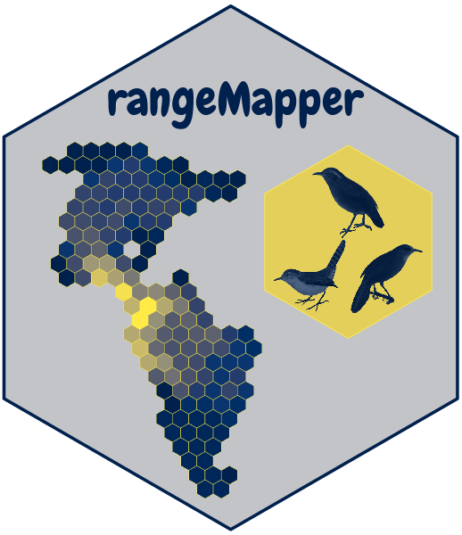
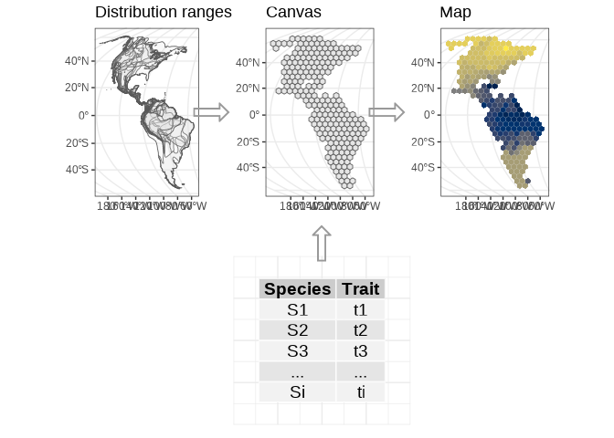

<!-- README.md is generated from README.Rmd. Please edit that file -->
<!-- 
rmarkdown::render('README.Rmd')
-->

# rangeMapper 

<!-- badges: start -->

[](https://github.com/mpio-be/rangeMapper/actions)
[](https://CRAN.R-project.org/package=rangeMapper)
[](https://CRAN.R-project.org/package=rangeMapper)
[](https://codecov.io/gh/mpio-be/rangeMapper?branch=master)

<!-- badges: end -->
<h4>
<a href="https://onlinelibrary.wiley.com/doi/10.1111/j.1466-8238.2011.00739.x" target="_blank">
A framework for the study of macroecological patterns of life-history
traits. </a>
</h4>

### `rangeMapper` builds upon three types of data:

1.  **Species distribution ranges**  
2.  **Life-history datasets**  
3.  **Environmental rasters**

### `rangeMapper` is build on three concepts:

1.  **The canvas** which is a regular grid of squares or hexagons.  
2.  **The subsets** which are defined by combinations of life-history
    datasets and map data.  
3.  **The maps** representing one or several variables summarised on the
    canvas.

<!-- -->

### File format

`rangeMapper`’s project containers are
<a href="https://www.sqlite.org/" target="_blank"> `sqlite` </a> files.

### Installation

``` r
# Install release version from CRAN
install.packages("rangeMapper")

# Install development version from GitHub
remotes::install_github("mpio-be/rangeMapper")
```
