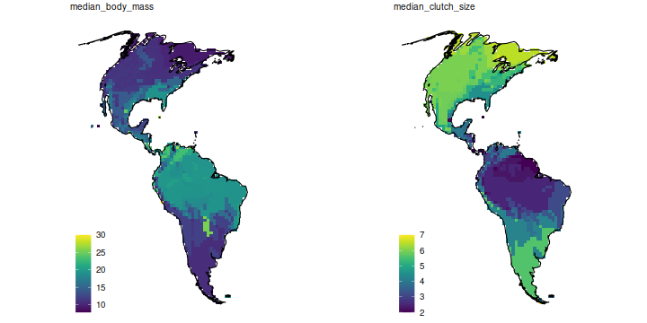

<!-- README.md is generated from README.Rmd. Please edit that file
knitr::knit('README.Rmd')
-->


[](https://travis-ci.org/valcu/rangeMapper)
[](https://codecov.io/github/valcu/rangeMapper?branch=master)
[](http://cran.r-project.org/package=rangeMapper)





### Installation

Install from github with:
```R
devtools::install_github("valcu/rangeMapper")
```
Install from CRAN with:
```R
install.packages("rangeMapper")
```
